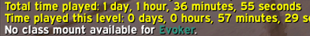
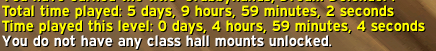

# Class Mount Summon

### Summon your Legion class mount easily with ```/cmount```

- Will warn you if your class does not have class mounts (Evoker)
- Will warn if you if you don't have any class mounts unlocked
- Will warn you if your class mount is tied to flight form (Druid)
- For classes with multiple mounts (Rogue, Paladin, Hunter), it will summon a randomly known class mount

Class has no mounts available:  


Class has class mounts, but none are unlocked/available:  


Druid warning:  


## To do
- [ ] Better warning message for classes with no class mounts available (just Evoker atm)
- [ ] Better warning message for Druids. Include a check if it's unlocked or not and display as such.
- [ ] Better class mount tracking, show which mounts are still locked
